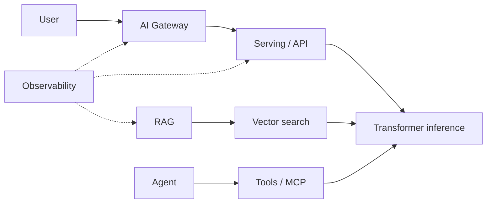

# Mental Models for AI Systems

Use this page when you encounter a new architecture. If you can **place each component in the pictures below**, you can reason about failures, cost, and security without memorizing vendor names.

For each model: **What should I visualize in my head?**

---

## Token

**Visualize:** A sentence shredded into **Lego bricks** from a fixed catalog (vocab ~32k–200k). Each brick has an ID. The model never sees “letters”—only IDs. Billing and context limits count bricks, not words.

**Chain:** Text → tokenizer → `[15496, 995, ...]` → embedding lookup.

**Failure:** Rare words split into many tokens → **cost spike** and context overflow.

---

## Embedding

**Visualize:** A **GPS coordinate in 768–4096 dimensions** for a word, sentence, or document. Nearby points = similar meaning (approximately). You cannot read the coordinate as English—it’s for math (dot product, ANN search).

**Chain:** Token IDs → mean/last-token pool → vector used for search or as model input.

**Failure:** Wrong embedding model for domain → “semantically close but wrong” retrieval.

---

## Attention

**Visualize:** Each token holds a **flashlight** over the rest of the sequence, deciding who to listen to. Bright beam on relevant tokens, dim on others. Stacking layers = repeated “who matters for my meaning?”

**Chain:** Q, K, V projections → score matrix → softmax weights → weighted sum of values.

**Failure:** Context too long → diffuse attention (“lost in the middle”); need RAG or summarization.

---

## Transformer

**Visualize:** A **pipeline of attention + feed-forward blocks** (like microservices for tensors). Data shape: `[batch, sequence, hidden]`. Decoder-only stacks predict next token; no separate “understanding module”—it’s all in the weights.

**Chain:** Embed → N × (Attention → FFN) → logits → sample.

**Failure:** Quadratic memory in naive attention over seq length → FlashAttention, sliding windows, etc.

---

## Context window

**Visualize:** A **fixed-size whiteboard**. Everything—system prompt, RAG chunks, chat history, tool outputs—must fit. When full, you erase oldest lines (truncate) or summarize (lossy).

**Chain:** Sum(token counts) ≤ window → else policy (drop, compress, retrieve harder).

**Failure:** Silent truncation of instructions or citations → wrong behavior.

---

## Inference

**Visualize:** Two-phase factory line:

1. **Prefill:** Read whole prompt in parallel (fill KV cache).
2. **Decode:** Stamp out one token at a time, each step using cache.

**Chain:** Prompt → prefill → loop(decode until stop).

**Failure:** Optimizing decode when prefill dominates (short outputs); or opposite for long prompts.

---

## RAG

**Visualize:** **Open-book exam**. Student (LLM) may only cite from pages you photocopied (retrieved chunks) plus what they memorized (weights). Librarian (retriever) picks pages; if wrong pages, answer fails even if student is smart.

```text
Question → embed → search index → top-k chunks → stuff prompt → LLM → answer + cites
```

**Failure:** Bad index, stale docs, chunk boundaries, injection in documents.

---

## Vector search

**Visualize:** **Nearest neighbors in a map**, but 1000+ dimensions and millions of points. Index (HNSW, IVF) = phone book tricks to avoid checking every point.

**Chain:** Query vector → ANN index → ids + scores → fetch text/metadata.

**Failure:** Approximate index misses true neighbor; no metadata filter → cross-tenant leak.

---

## Reranking

**Visualize:** **First pass:** cheap net catches 50 fish. **Second pass:** chef inspects top 10 properly. Cross-encoder or LLM scores (query, doc) pairs accurately but slowly.

**Chain:** top-100 vector → rerank → top-5 to LLM.

**Failure:** Skipping rerank saves latency but hurts precision on hard queries.

---

## Agent

**Visualize:** **Intern with a phone**, calling APIs (tools) until done. Manager (your code) sets max calls, budget, and approval for dangerous actions.

```text
while not done:
    LLM → thought + optional tool call
    runtime executes tool → result back to LLM
```

**Failure:** Infinite loop, wrong tool args, prompt injection via tool output.

---

## Tool

**Visualize:** A **typed RPC** the model may invoke: name + JSON schema. Runtime validates, authz, executes, returns string/JSON to model.

**Chain:** Model emits tool_call → gateway checks policy → handler → observation message.

**Failure:** Over-privileged tool = remote code execution by prompt.

---

## MCP (Model Context Protocol)

**Visualize:** **USB-C for AI tools**—standard plug shape so any client can discover tools/resources/prompts from a server without custom glue per IDE.

```text
Client (Cursor, agent) ←JSON-RPC→ MCP Server (K8s, Git, metrics)
```

**Failure:** Treating MCP as auth boundary—it isn’t; still need network policy and secrets hygiene.

---

## Model serving

**Visualize:** **Specialized restaurant kitchen** for one heavy dish (the model). Queue out front, batch orders on the grill (GPU), plates stream out (tokens). Not “just another HTTP pod”—VRAM and batching dominate.

```text
Clients → queue → scheduler → GPU workers → stream tokens
```

**Failure:** OOM, queue latency, cold start loading 70GB weights.

---

## GPU

**Visualize:** Thousands of **simple workers** (cores) doing the same math on different data—perfect for big matrix multiply. **VRAM** = tiny warehouse shelf; if model + KV + batch don’t fit, job dies.

**Chain:** Host CPU loads weights → CUDA kernels on device → PCIe bottleneck if shuffling carelessly.

**Failure:** GPU at 30% util because batch too small or CPU preprocessing slow.

---

## KV cache

**Visualize:** **Sticky notes** on each layer for every past token’s K and V so decode doesn’t re-read the whole book. Notes grow with sequence length × batch size.

**Chain:** Prefill writes cache; each decode step appends one position.

**Failure:** Long chat + big batch → OOM; paging (PagedAttention) mitigates.

---

## Batching

**Visualize:** **Carpool**: one GPU trip carries multiple sequences. Static batch = wait until car full (latency). Continuous batch = passengers hop in/out each stop (throughput).

**Chain:** Requests → scheduler groups → one forward → split outputs.

**Failure:** Head-of-line blocking if one sequence generates 10k tokens.

---

## Quantization

**Visualize:** **Rounding prices** from $12.347 to $12.35—mostly same shopping cart, occasionally wrong item. INT4/INT8 weights = smaller, faster, less VRAM.

**Chain:** FP16 baseline → calibrate → quantized weights → inference kernels.

**Failure:** Quality drop on math/code; need eval per model + quant combo.

---

## Inference gateway (AI gateway)

**Visualize:** **Air traffic control** for models: authenticate flight plans, route to runway (provider/model), hold patterns (rate limits), divert on storms (circuit breaker), log fuel (tokens/$).

```text
Apps → gateway (policy) → {OpenAI, Anthropic, vLLM local}
```

**Failure:** Gateway bypassed by one team with raw API keys → no cost or security visibility.

---

## AI platform

**Visualize:** **Internal cloud for AI primitives**: catalog of models, prompts, datasets, eval runs, tenants, quotas—so product teams ship features without owning GPUs or vendor contracts individually.

```text
Teams → platform APIs → shared gateway, RAG, agents, observability, governance
```

**Failure:** Platform too restrictive → shadow AI; too loose → cost and data incidents.

---

## AI observability

**Visualize:** **Flight recorder** for stochastic APIs: traces per request (retrieve → generate), metrics (TTFT, tokens/sec, error rate), logs (redacted), eval scores over time—not just CPU graphs.

**Chain:** Instrument SDK → OTel → Prometheus/Grafana + trace backend + cost warehouse.

**Failure:** Logging full prompts with PII; or only monitoring HTTP 200 while answers are wrong.

---

## How to use these together



When debugging, ask:

1. Which box failed?
2. Is it **data** (retrieval), **policy** (gateway), **compute** (GPU/batch), or **model behavior** (eval)?

---

## Interview Questions

### Level 1

1. Draw token → embedding → logits in three boxes.
2. What is KV cache in one sentence?
3. RAG vs “model memory”?
4. What does an agent loop do?
5. GPU vs CPU for LLMs?

### Level 2

1. Prefill vs decode latency.
2. Why vector search then rerank?
3. What is MCP?
4. Continuous batching benefit?
5. What does gateway add vs raw API?

### Senior

1. Trace one RAG request for observability spans.
2. Multi-tenant: where enforce isolation?
3. Cost drivers on one diagram.

### Staff

1. Teach mental models to a backend team in 10 minutes—outline.
2. Platform primitives vs product features line.

### FDE

1. Whiteboard agent + RAG for customer incident response—label failure points.

---

## Practical Exercise

Pick a production incident you’ve seen (any domain). Re-map it onto this diagram with **hypothetical** AI components—practice explaining where you’d instrument first.

---

## Mini Project

One-page **personal cheat sheet** (PDF or md): draw all 20 models from memory; compare to this doc and fill gaps.
