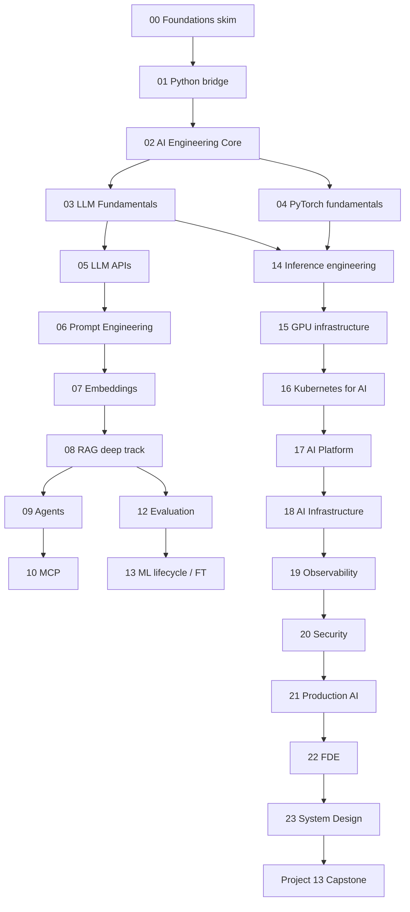

# AI Engineering Master — Roadmap (v2)

**Flexible 12–18 months** · **Exit-criteria driven** (not fixed weeks) · Optimized for **backend/platform/infra → Staff / FDE**.

Read first: [CURRICULUM_REVIEW.md](./CURRICULUM_REVIEW.md) · [ai-to-existing-engineering-map.md](./ai-to-existing-engineering-map.md)

---

## Career progression (curriculum spine)

```text
Senior Backend / Platform Engineer
              ↓
         AI Engineer
              ↓
     AI Platform Engineer
              ↓
 AI Infrastructure / Inference
              ↓
 Staff AI / AI Infrastructure
              ↓
      FDE / AI Solutions
```

---

## Time allocation

### Default (application-balanced)

| Theory | Implementation | Projects | System design | Interview |
|--------|----------------|----------|---------------|-----------|
| 20% | 30% | 30% | 10% | 10% |

### Advanced modules (inference, platform, infra, K8s-for-AI)

| Theory | Projects | System design | Interview |
|--------|----------|---------------|-----------|
| 20% | 40% | 20% | 20% |

Adjust weekly hours (8–20h); advance phases when **exit criteria** are met.

---

## Dual track (same phases, different emphasis)

| Track | Who | Emphasis |
|-------|-----|----------|
| **A — Application** | AI Engineer, Solutions | RAG, agents, eval, prompts |
| **B — Platform/Infra** | Platform, Infra, Staff | Gateway, serving, GPU, capacity, observability |

You should run **A deep enough for interviews** and **B deep enough for your moat**—see map in `ai-to-existing-engineering-map.md`.

---

## Dependency graph (v2)



---

## Phase 1 — Map & bridge (2–3 weeks)

| Work | Module / doc |
|------|----------------|
| Skim or deep-dive | `00-foundations` (see [README](./00-foundations/README.md)) |
| Short bridge | `01-python-for-ai-engineering` (productivity only) |
| **Required** | `02-ai-engineering-core` → `ai-system-mental-model.md` |
| Read | `ai-to-existing-engineering-map.md` |

**Exit criteria:** Draw full stack (app → platform → serving → K8s/GPU); explain Training vs FT vs Inference vs RAG vs Agents.

---

## Phase 2 — LLM & chat APIs (4–6 weeks)

| Work | Module / project |
|------|------------------|
| Theory | `03-llm-fundamentals` (expanded) |
| Integration | `05-llm-apis`, `06-prompt-engineering` |
| Build | **P01** LLM API · **P02** Streaming chat |
| Eval hook | `12-evaluation` (intro): golden set for chat |

**Exit criteria:** Prefill vs decode; sampling params; streaming + token metrics; structured output + tools (bounded).

---

## Phase 3 — RAG flagship (6–8 weeks)

| Work | Module / project |
|------|------------------|
| Theory | `07-embeddings-and-vector-search`, **`08-rag`** (ingestion → production) |
| Security thread | RAG ACL, poisoning (preview → `20-ai-security`) |
| Build | **P03** RAG · **P04** RAG eval platform · **P05** Production RAG |

**Exit criteria:** Hybrid + rerank; MRR/nDCG or retrieval metrics; faithfulness eval; multi-tenant index design on paper.

---

## Phase 4 — Agents & MCP (4–6 weeks)

| Work | Module / project |
|------|------------------|
| Theory | `09-agents`, `10-mcp` (enterprise security) |
| Compare | `11-ai-frameworks` (tradeoffs only) |
| Build | **P06** Agent · **P07** MCP (5 servers) |

**Exit criteria:** Workflow vs agent decision; HITL; tool sandbox; MCP authZ; agent eval metrics.

---

## Phase 5 — Platform & gateway (4–6 weeks)

| Work | Module / project |
|------|------------------|
| Theory | **`17-ai-platform-engineering`** |
| Build | **P09** AI Gateway (Go)—**recommended before or parallel to P10** for platform track |
| Cross-cut | Cost allocation, audit logs, prompt registry concepts |

**Exit criteria:** Explain what an internal AI platform team ships; route models by policy; per-tenant quotas.

---

## Phase 6 — Inference, PyTorch, GPU (6–8 weeks)

| Work | Module / project |
|------|------------------|
| Literacy | `04-pytorch-fundamentals` |
| Depth | **`14-inference-engineering`** (math: params, KV, throughput) |
| Hardware | `15-gpu-and-accelerator-infrastructure` |
| Build | **P10** Model serving (vLLM + K8s) |

**Exit criteria:** KV cache memory estimate; quant trade-offs; tokens/sec vs latency; why inference is expensive (numbers).

---

## Phase 7 — Kubernetes & AI infrastructure (4–6 weeks)

| Work | Module / project |
|------|------------------|
| Theory | `16-kubernetes-for-ai` (no basic K8s), **`18-ai-infrastructure`** |
| Labs | Capacity planning exercises (see infra module) |
| Build | **P08** K8s AI agent (if not done in Phase 4) |

**Exit criteria:** GPU scheduling story; autoscaling inference; HA + DR outline; **10M req/day** style problem worked.

---

## Phase 8 — Observability, security, production (3–4 weeks)

| Work | Module / project |
|------|------------------|
| Theory | `19-observability`, `20-ai-security`, `21-production-ai` |
| Build | **P11** AI observability dashboards |
| Artifacts | Threat models for RAG + agent + gateway |

**Exit criteria:** Dashboards for TTFT, tokens, RAG faithfulness, agent tool failures; STRIDE-style AI doc.

---

## Phase 9 — ML lifecycle & fine-tuning (3–4 weeks, can overlap Phase 6)

| Work | Module / project |
|------|------------------|
| Theory | **`13-ml-lifecycle-fine-tuning`** |
| Build | Small LoRA/QLoRA lab (low GPU) |
| Decision | Prompt vs RAG vs FT vs continued pretrain |

**Exit criteria:** Registry → deploy → monitor loop; when **not** to fine-tune.

---

## Phase 10 — FDE & system design (4–6 weeks)

| Work | Module |
|------|--------|
| FDE | `22-fde-engineering` (7 case studies) |
| Design | `23-system-design` (20+ problems) |
| Interview | `INTERVIEW_MASTER.md` + `25-interview-preparation` |

**Exit criteria:** One written case end-to-end; one timed system design with cost + security.

---

## Phase 11 — Tenancy & capstone (8–12 weeks)

| Work | Project |
|------|---------|
| Build | **P12** Multi-tenant AI platform |
| Build | **P13** Enterprise AI platform capstone |

**Exit criteria:** Isolation tests; Terraform/Helm; CI eval gates; DR + autoscaling story.

---

## Project ladder (13)

See [22-projects/README.md](./22-projects/README.md) and [PROJECT_STANDARDS.md](./22-projects/PROJECT_STANDARDS.md).

---

## What to skip (your profile)

- Basic Git, Docker, REST, Kubernetes pod tutorials.
- Long `00-foundations` math unless targeting math-heavy AI Engineer screens—use **skim path**.
- General Python mastery—stay on [01 bridge scope](./01-python-for-ai-engineering/README.md).
- `11-ai-frameworks` as deep study—**compare** only after raw agent/RAG loops.

**Never skip:** eval, security, cost, observability, failure modes, capacity planning.

---

## Knowledge checkpoints

| After | Checkpoint |
|-------|------------|
| `02-ai-engineering-core` | Stack diagram + lifecycle decision tree |
| `08-rag` | 8 conceptual + 2 coding tasks |
| `09-agents` | “Agent vs workflow” for 3 scenarios |
| `14-inference` | KV memory + tokens/sec calculation |
| `17-ai-platform` | Cut cost 50% worksheet |
| `22-fde` | Bank RAG case (discovery → rollout) |

---

## Authoring order (post-approval)

1. `02-ai-engineering-core/ai-system-mental-model.md`
2. Complete short `01-python` bundle
3. `03-llm-fundamentals` (tokens → sampling → lifecycle doc)
4. Continue per [STRUCTURE.md](./STRUCTURE.md) priority flags

**Current repo status:** v2 architecture applied; lesson content for modules above not yet written (except `00-foundations` + partial `01`).
